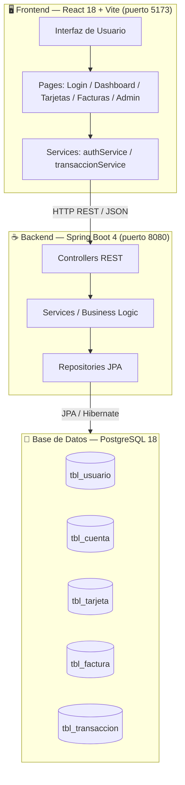
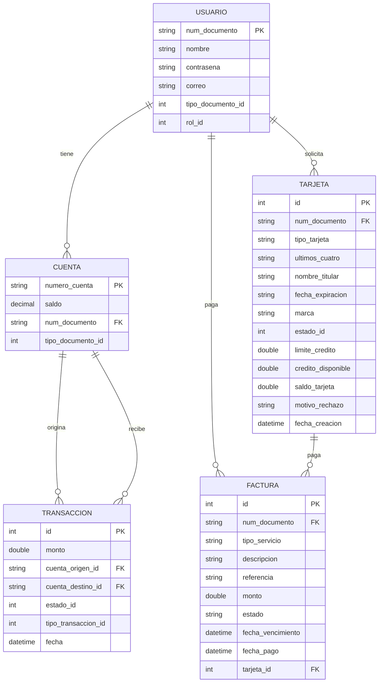
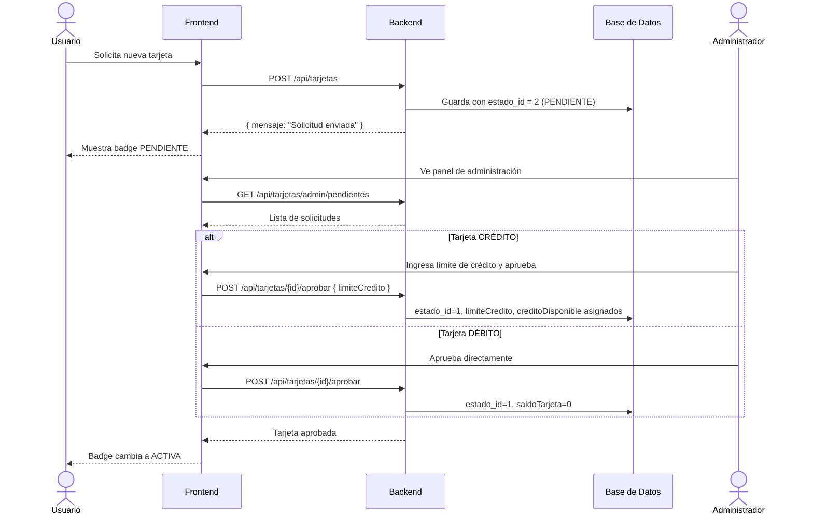
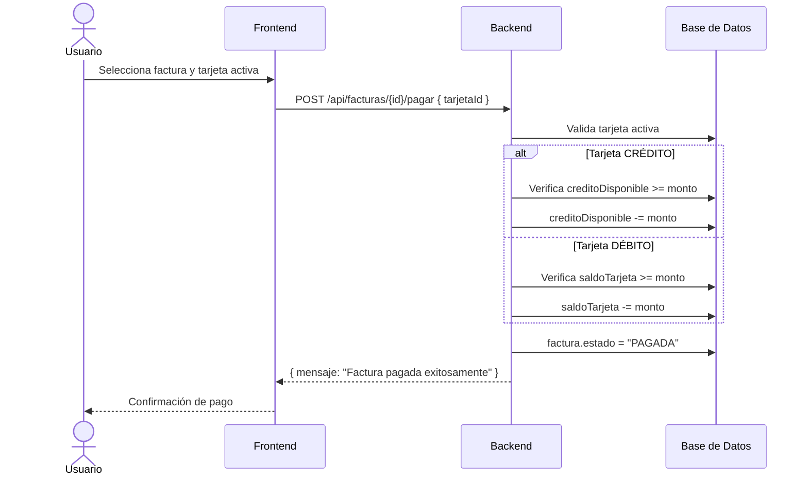
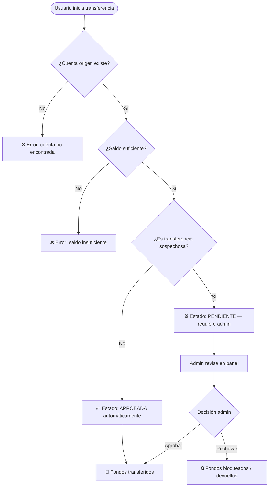
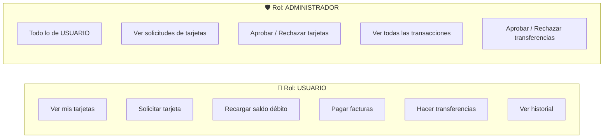

# 🛡️ FinBank - backend de un banco digital

<div align="center">


**Plataforma bancaria fullstack con detección de fraude, gestión de tarjetas, facturas y transferencias en tiempo real.**

</div>

---

## 📋 Tabla de Contenidos

- [Descripción General](#-descripción-general)
- [Arquitectura del Sistema](#-arquitectura-del-sistema)
- [Stack Tecnológico](#-stack-tecnológico)
- [Estructura del Proyecto](#-estructura-del-proyecto)
- [Modelo de Datos](#-modelo-de-datos)
- [API REST — Endpoints](#-api-rest--endpoints)
- [Flujos de Negocio](#-flujos-de-negocio)
- [Requisitos Previos](#-requisitos-previos)
- [Instalación y Configuración](#-instalación-y-configuración)
- [Variables de Entorno](#-variables-de-entorno)
- [Ejecución en Desarrollo](#-ejecución-en-desarrollo)
- [Roles y Permisos](#-roles-y-permisos)

---

## 🔍 Descripción General

**FraudeShield** es una aplicación bancaria fullstack orientada a la detección y prevención de fraude financiero. Permite a usuarios gestionar cuentas, solicitar tarjetas (crédito/débito), pagar facturas de servicios y realizar transferencias, mientras un panel de administración centraliza la revisión y aprobación de operaciones sospechosas.

### Características Principales

| Módulo                | Descripción                                                             |
| --------------------- | ----------------------------------------------------------------------- |
| 👤 **Autenticación**  | Login por documento + contraseña con gestión de roles                   |
| 🏦 **Cuentas**        | Gestión de cuentas bancarias con saldo en tiempo real                   |
| 💳 **Tarjetas**       | Solicitud, aprobación admin, crédito y débito con saldos independientes |
| 🧾 **Facturas**       | Generación y pago de facturas de servicios públicos                     |
| 🔄 **Transferencias** | Transferencias entre cuentas con validación antifraude                  |
| 🛡️ **Admin Panel**    | Aprobación/rechazo de tarjetas y transferencias pendientes              |

---

## 🏛️ Arquitectura del Sistema



---

## 🗂️ Estructura del Proyecto

```
fraude-detection/
│
├── 📁 src/main/java/com/fraude/
│   ├── 🏦 cuenta/               # Modelo, repositorio de cuentas bancarias
│   ├── 💳 tarjeta/              # Solicitud, aprobación, recarga de tarjetas
│   │   ├── controller/          # TarjetaController — endpoints REST
│   │   ├── model/               # Tarjeta.java — entidad JPA
│   │   ├── repository/          # TarjetaRepository
│   │   └── service/             # TarjetaService — lógica de negocio
│   ├── 🧾 factura/              # Generación y pago de facturas
│   ├── 🔄 transaccion/          # Procesamiento y validación de transferencias
│   ├── 👤 usuario/              # Registro, login y gestión de usuarios
│   ├── 🔑 rol/                  # Roles del sistema (ADMIN / USER)
│   ├── 📊 reporte/              # Módulo de reportes
│   └── ⚙️ config/               # CORS, seguridad, configuración general
│
├── 📁 src/main/resources/
│   └── application.properties   # Configuración de BD, servidor, Stripe
│
├── 📁 frontend/promptly-fluent/
│   ├── 📁 src/
│   │   ├── pages/               # Login, Dashboard, Tarjetas, Facturas, Admin
│   │   ├── components/          # AppLayout, NavLink, StatusBadge + shadcn/ui
│   │   ├── services/            # Llamadas a la API REST
│   │   ├── hooks/               # useAuth, use-toast, use-mobile
│   │   ├── lib/                 # utils, roles
│   │   └── data/                # Datos mock
│   ├── vite.config.ts
│   ├── tailwind.config.ts
│   └── package.json
│
├── pom.xml                      # Dependencias Maven
├── mvnw / mvnw.cmd              # Maven Wrapper
└── README.md
```

---

## 🗄️ Modelo de Datos



### Estados de Tarjeta

| `estado_id` | Estado       | Descripción                    |
| :---------: | ------------ | ------------------------------ |
|     `1`     | ✅ ACTIVA    | Lista para usar                |
|     `2`     | ⏳ PENDIENTE | Esperando aprobación del admin |
|     `3`     | 🗑️ ELIMINADA | Cancelada por el usuario       |
|     `4`     | ❌ RECHAZADA | Rechazada por el admin         |

---

## 🔌 API REST — Endpoints

### Transacciones

| Método | Ruta                             | Descripción               | Rol     |
| ------ | -------------------------------- | ------------------------- | ------- |
| `POST` | `/api/transacciones`             | Crear nueva transferencia | Usuario |
| `GET`  | `/api/transacciones/cuenta/{id}` | Historial de cuenta       | Usuario |
| `GET`  | `/api/transacciones`             | Todas las transacciones   | Admin   |
| `GET`  | `/api/transacciones/pendientes`  | Transacciones pendientes  | Admin   |
| `PUT`  | `/api/transacciones/{id}/estado` | Aprobar / Rechazar        | Admin   |

### Tarjetas

| Método   | Ruta                             | Descripción                | Rol     |
| -------- | -------------------------------- | -------------------------- | ------- |
| `GET`    | `/api/tarjetas`                  | Mis tarjetas               | Usuario |
| `POST`   | `/api/tarjetas`                  | Solicitar tarjeta          | Usuario |
| `POST`   | `/api/tarjetas/{id}/recargar`    | Recargar saldo (débito)    | Usuario |
| `DELETE` | `/api/tarjetas/{id}`             | Cancelar tarjeta           | Usuario |
| `GET`    | `/api/tarjetas/admin/pendientes` | Ver solicitudes pendientes | Admin   |
| `GET`    | `/api/tarjetas/admin/todas`      | Ver todas las tarjetas     | Admin   |
| `POST`   | `/api/tarjetas/{id}/aprobar`     | Aprobar solicitud          | Admin   |
| `POST`   | `/api/tarjetas/{id}/rechazar`    | Rechazar solicitud         | Admin   |

### Facturas

| Método | Ruta                           | Descripción           | Rol     |
| ------ | ------------------------------ | --------------------- | ------- |
| `GET`  | `/api/facturas`                | Mis facturas          | Usuario |
| `POST` | `/api/facturas/generar-prueba` | Generar facturas demo | Usuario |
| `POST` | `/api/facturas/{id}/pagar`     | Pagar factura         | Usuario |

> **Header requerido:** `X-User-Documento: {numDocumento}` en todos los endpoints de usuario.

---

## 🔄 Flujos de Negocio

### Flujo: Solicitud y Aprobación de Tarjeta



### Flujo: Pago de Factura con Tarjeta



### Flujo: Transferencia con Validación Antifraude



---

## ⚙️ Requisitos Previos

Asegúrate de tener instalados:

| Herramienta | Versión mínima           | Verificar         |
| ----------- | ------------------------ | ----------------- |
| Java JDK    | 17+                      | `java -version`   |
| Maven       | 3.9+ (incluido con mvnw) | `./mvnw -version` |
| Node.js     | 18+                      | `node -version`   |
| npm         | 9+                       | `npm -version`    |
| PostgreSQL  | 14+                      | `psql -version`   |

---

## 🚀 Instalación y Configuración

### 1. Clonar el repositorio

```bash
git clone https://github.com/tu-usuario/fraude-detection.git
cd fraude-detection
```

### 2. Configurar la base de datos

```sql
-- Conectar como superusuario (postgres)
CREATE USER fraude_user WITH PASSWORD 'fraude_pass';
CREATE DATABASE fraude_detection OWNER fraude_user;
GRANT ALL PRIVILEGES ON DATABASE fraude_detection TO fraude_user;
```

### 3. Configurar application.properties

Edita `src/main/resources/application.properties`:

```properties
spring.datasource.url=jdbc:postgresql://localhost:5432/fraude_detection
spring.datasource.username=fraude_user
spring.datasource.password=fraude_pass
spring.jpa.hibernate.ddl-auto=update
server.port=8080
```

> ⚠️ Las tablas se crean automáticamente gracias a `ddl-auto=update` al arrancar la app.

### 4. Instalar dependencias del frontend

```bash
cd frontend/promptly-fluent
npm install
```

---

## 🔐 Variables de Entorno

| Variable                     | Descripción                  | Ejemplo                                             |
| ---------------------------- | ---------------------------- | --------------------------------------------------- |
| `spring.datasource.url`      | URL de conexión a PostgreSQL | `jdbc:postgresql://localhost:5432/fraude_detection` |
| `spring.datasource.username` | Usuario de BD                | `fraude_user`                                       |
| `spring.datasource.password` | Contraseña de BD             | `fraude_pass`                                       |
| `server.port`                | Puerto del backend           | `8080`                                              |

> 🔒 **Seguridad**: Nunca subas credenciales reales al repositorio. Usa variables de entorno del sistema en producción.

---

## ▶️ Ejecución en Desarrollo

### Backend (Spring Boot)

```bash
# Desde la raíz del proyecto
./mvnw spring-boot:run          # Linux/Mac
.\mvnw.cmd spring-boot:run      # Windows
```

El servidor arranca en → **http://localhost:8080**

### Frontend (React + Vite)

```bash
cd frontend/promptly-fluent
npm run dev
```

La aplicación arranca en → **http://localhost:5173**

### Build de producción

```bash
# Backend
./mvnw clean package -DskipTests

# Frontend
cd frontend/promptly-fluent
npm run build
```

---

## 👥 Roles y Permisos



| Acción                          | Usuario | Admin |
| ------------------------------- | :-----: | :---: |
| Ver mis tarjetas                |   ✅    |  ✅   |
| Solicitar tarjeta               |   ✅    |  ✅   |
| Aprobar/rechazar tarjetas       |   ❌    |  ✅   |
| Pagar facturas                  |   ✅    |  ✅   |
| Realizar transferencias         |   ✅    |  ✅   |
| Ver todas las transacciones     |   ❌    |  ✅   |
| Aprobar/rechazar transferencias |   ❌    |  ✅   |

---

## 🏗️ Tecnologías Utilizadas

### Backend

- **Spring Boot 4.0.4** — Framework principal
- **Spring Data JPA + Hibernate 7** — ORM y acceso a datos
- **PostgreSQL** — Base de datos relacional
- **Lombok** — Reducción de código boilerplate
- **Jakarta Validation** — Validación de datos en endpoints

### Frontend

- **React 18** — Librería de UI
- **TypeScript 5** — Tipado estático
- **Vite 5** — Bundler y servidor de desarrollo
- **TailwindCSS** — Framework de estilos utilitarios
- **shadcn/ui + Radix UI** — Componentes accesibles de alta calidad
- **React Hook Form** — Gestión de formularios
- **Sonner** — Notificaciones toast

---

<div align="center">

**Desarrollado con ❤️ — FraudeShield © 2026**

</div>
